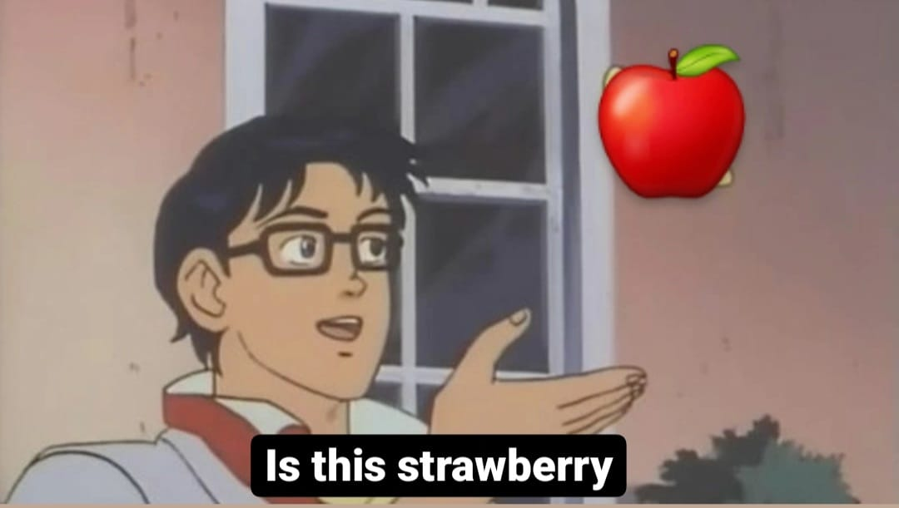

# Looking-Fruit

    

:wave: Hello and welcome to the **:apple: Looking-Fruit** code repository. This is a short and simple computer vision project. In this project, I replicate and try to improve the models used to classify images of fruits. You can see the research paper [here](https://www.researchgate.net/publication/321475443_Fruit_recognition_from_images_using_deep_learning). The original code repository can be found [here](https://github.com/Horea94/Fruit-Images-Dataset).

  
<strong>See the abstract of the paper</strong>

    In this paper we introduce a new, high-quality, dataset of images
containing fruits. We also present the results of some numerical experiment for training a neural network to detect fruits. We discuss the
reason why we chose to use fruits in this project by proposing a few
applications that could use such classifier.

## Introduction

In this paper, the people made a dataset from scratch (i.e. took the images themselves). In the paper they used this dataset to classify images of fruits, using the Tensorflow. Each model achieved 100% accuracy on the training set. To classify images, I used the Tensorflow library (just like the people who did the paper) to make neural networks which classify the images.
