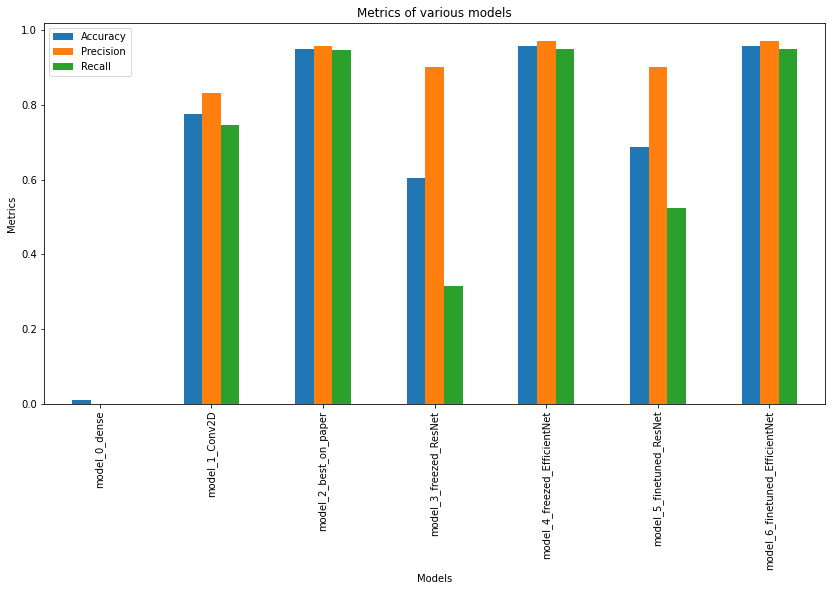

# Looking_Fruit

[](https://colab.research.google.com/github/ishandandekar/Looking-Fruit/blob/main/Looking_Fruit_nbk.ipynb)

<p align="center">
    
</p>

:wave: Hello and welcome to the **Looking_Fruit :apple:** code repository. This is a short and simple computer vision project. In this project, I replicate and try to improve the models used to classify images of fruits. You can see the research paper [here](https://www.researchgate.net/publication/321475443_Fruit_recognition_from_images_using_deep_learning). The original code repository can be found [here](https://github.com/Horea94/Fruit-Images-Dataset). This is my first independant paper replication project :smile:.  
If you encounter any errors while running the notebook yourself, make sure to add it as an issue in the Issues tab of the repository's Github page.

## Introduction

The **objective** of the research paper was to classify images various fruits and vegetables correctly. The researchers made a total of 10 models based and documented there results. The main of this project is to beat and/or achieve the highest score on the test set when compared to their best model. In the process to do this, I made a total of 7 models (including the best model researchers made), hoping each model iteration will get a better result.

**Abstract of the paper:**  
In this paper we introduce a new, high-quality, dataset of images
containing fruits. We also present the results of some numerical experiment for training a neural network to detect fruits. We discuss the
reason why we chose to use fruits in this project by proposing a few
applications that could use such classifier.

## Data

The original data for the paper was published and created by the researchers themselves. The dataset contains a total of around **90,000** images of **131** fruits and vegetables. The data is then split into two sets: training and testing sets. This test set contains almost 25% of the total dataset.  
The training data has around **400+ images for each class** (except Ginger Root). Although, the model would get generalised more on more data, but due to unnecessarily huge size of the dataset, it was trimmed for training the models better. Further, data augmentation was performed to make the model make better predictions on new images.
The test data was kept separately untouched, and was used just to evaluate the models on unknown data. Each class had around **100+** images. This data was not augmented.

For my ease-of-use I uploaded the original dataset available on Github to Kaggle, and used this for the project. Check out the dataset [here](https://www.kaggle.com/datasets/ishandandekar/fruitimagedataset) and do try making models yourself! During the modelling phase, it was observed that this much data was a little too excessive. Training data was then trimmed so that, each class only has **100** images.

> **Note**: You can also check out the original dataset on [Github](https://github.com/Horea94/Fruit-Images-Dataset) or [Kaggle](https://www.kaggle.com/datasets/moltean/fruits)

## Models

1. **Model 0** : This is a simple model with fully connected multiple Dense layers; this model acts as a baseline. This model is made using only Dense layer. As known, an ANN is weak in classifying images. But, this acts as a good baseline. The model was trained for 10 epochs and used Adam optimizer to update weights. The model got an accuracy 1%, with precision and recall as 0. The model has performed worse than imagined. See [architecture](assets/model_0.png).
1. **Model 1** : This model has multiple pairs of CNN and MaxPool layers with a Flatten layer and 2 Dense layers in the end for classification. The model was trained for 10 epochs and used Adam optimizer to update weights. This model was expected to get much better results than the previous model.. The model was expected to get way better results than the previous model. It got an accuracy of 77.5%, along with 0.83 as precision and 0.74 as recall score. See [architecture](assets/model_1.png)
1. **Model 2** : This is the exact same model that researchers used in their paper. This was suppossed to get outstanding results on test set. The model included multiple pairs of `Conv2D` and `MaxPool` layers to perform convolutional operations. In the bottom layers, it has 2 `Dense` layers, each followed by a `Dropout` layer. This was added to further add randomness to predictions. A final `Dense` layer is used to classify the inputs. The model (as seen in the paper) performed the best amongst others. It got an accuracy of 94% with precision being 0.95, and recall score being 0.94. It got substantially better results than other previous models. See [architecture](assets/model_2.png).
1. **Model 3** : This model uses **ResNet50** as its base. Using transfer learning, to exploit other models parameters can be a useful tool. ResNet model required to the image tensors to be scaled between 0 and 1. The model consists of 5 layers. The `Input` layer confirms and transforms the tensors into the specified shape. The `Rescaling` layer scales the numbers into 0 to 1. Then the ResNet model does its work. A `GlobalAveragePooling` layer is used to decrease the count of numbers. A final `Dense` layer then classifies the tensors into categories. This model used transfer learning to get the ResNet50 as its base. Although, transfer learning works better on little data, the model was trained on the whole training set. It was observed (during training), that the model had a gradual decrease in the validation loss, inferring that if given more epochs to train on, the model could perform better. The model got an accuracy of 60%, precision of 0.901 and recall as 0.314. See [architecture](assets/model_3.png).
1. **Model 4** : Unlike the previous model, this one uses **EfficientNetB0** under the hood. Using a different architecture could be benefitial. By default, `EfficientNetB0` does not need the input tensors to be scaled between 0 and 1. The model has a total of 4 layers. The `Input` layer confirms and transforms the input tensors into the required shape. Then comes the `EfficientNetB0` model and does various convolutional operations. The `GlobalAveragePooling` layer then condenses the tensors into a (1,3) tensor by taking average. The final `Dense` layer then classifies the tensors into categories. This model quickly adapted to the dataset and got better results than the previous model using ResNet. The model got an accuracy of 95%, precision of 0.97 and recall score of 0.949. See [architecture](assets/model_4.png).
1. **Model 5** : This model uses a **fine-tuned ResNet50** as its base. Model 3 used ResNet50 as its base. Although, the model didn't actually learn anything. The parameters were frozen i.e. these did not change when the model was training. Fine-tuning these models make the models train and learn the features in our dataset. The bottom ten layers were set so that their parameters can be changed and can adapt to the dataset. This model is same as model 3, the only difference being that now the ResNet model can also change its parameters and adapt on the training examples to give better and more accuracte predictions. The other model which used ResNet, performed rather poorly on the test set. Although, it was taking more time to adapt to the dataset. Using fine-tuning, method it was expected to get better results. The model achieved an accuracy of 68%, with precision score as 0.902 and recall as 0.52. See [architecture](assets/model_5.png).
1. **Model 6** : This model uses a **fine-tuned EfficientNetB0** under its hood. The model's last ten layers have been set in such a way that their parameters can be trained and changed according to the training examples. This helps to give better and more accurate predictions. This model is same as model 4, the only difference being that now the parameters within the base model can now be trained too. Model 4 performed really well on the test set. Fine-tuning would only better the results. The model got an accuracy of 95%, precision of 0.97 and recall as 0.95. See [architecture](assets/model_6.png).

<p align="center">
    
</p>

## Contents of the repository

```
Looking_Fruit/
├─ assets/
├─ models/
├─ notebooks/
├─ scripts/
├─ .gitignore
├─ LICENSE.md
├─ README.md
```

- _assets_ : Contains various media materials which were helpful for the project and its documentation.
- _models_ : Contains all the models created during experimentation.
- _notebooks_ : Contains all the notebooks used for the analysis of the dataset and making models for predictions.
- _scripts_ : Contains various program scripts required during modelling experiments and analysis.
- _.gitignore_ : File was used to make `git` not track certain private files.

## Contribution

Although this is not a conventional open-source project, if you find any errors (even a typo!) and/or want to improve something in the repository, and/or want to help document the project, feel free to create a pull request! :smile:

If you encounter any errors or see any mistake in anything, make sure to add it as an issue in the Issues tab on this repository's Github page. A special thanks to all the researchers behind this paper.
